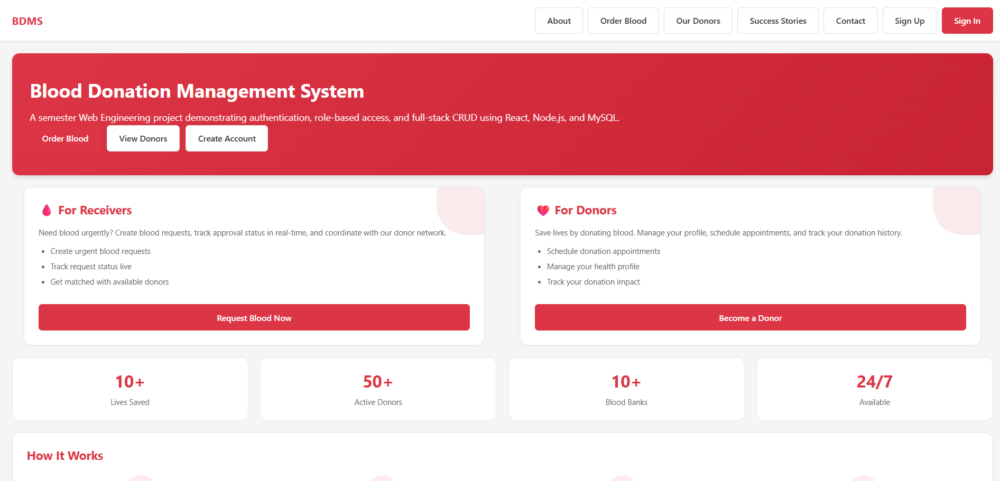
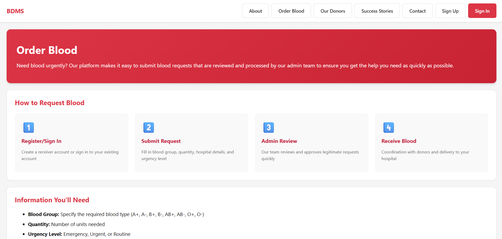
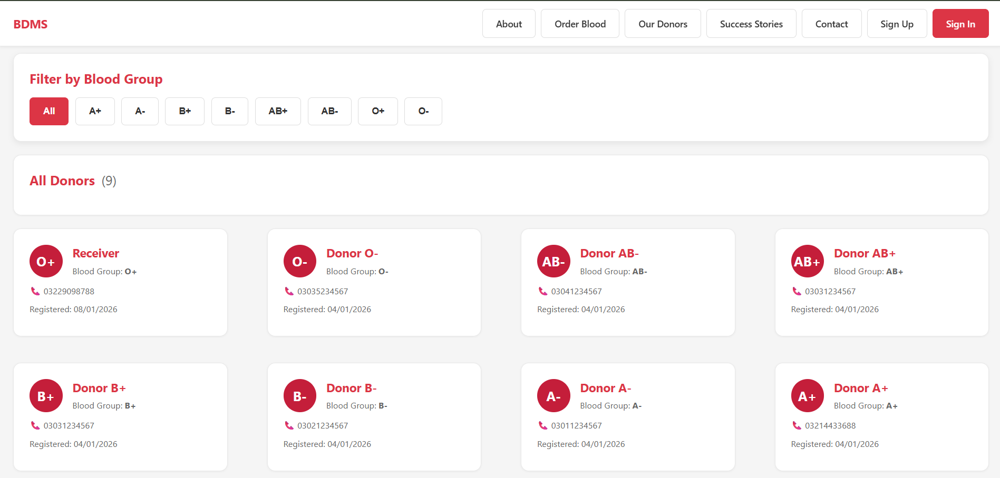
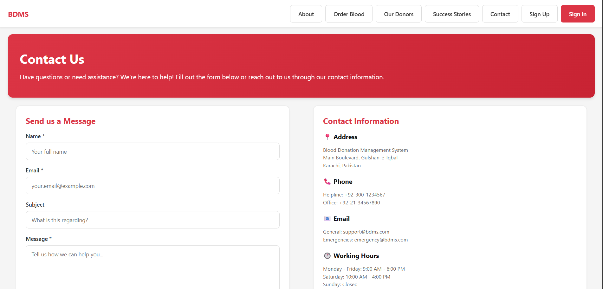
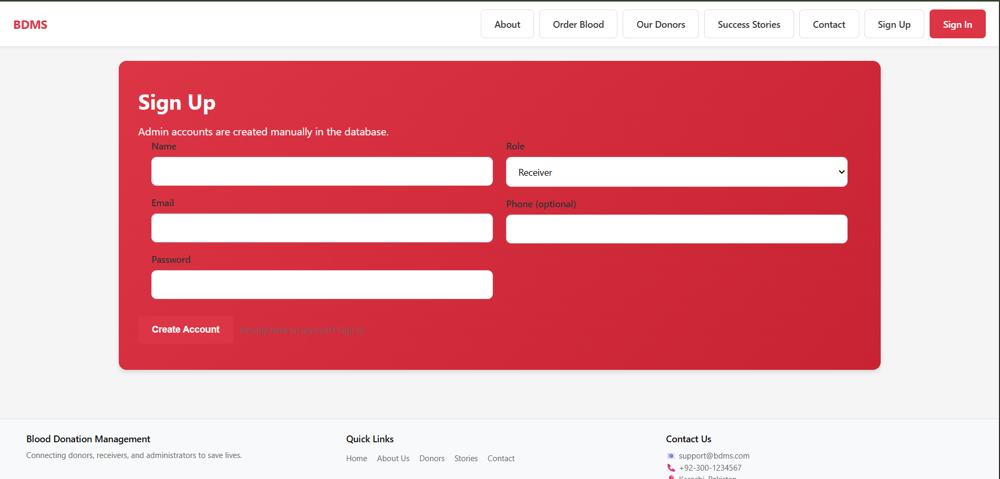

# Blood Donation Management System

> A **Blood Donation Management System** designed to manage donors, recipients, blood requests, and availability in an organized and efficient way. This project focuses on simplifying the blood donation workflow while keeping records accurate and easy to access.

  

## Short Introduction

This project provides a centralized system for managing blood donation data, including donor registration, blood group tracking, and request handling. It is built to demonstrate practical software development concepts with a real-world use case in healthcare support systems.

## Description

The **Blood Donation Management System** is designed to help blood banks, hospitals, or small organizations digitally manage blood donation activities.  
Instead of handling records manually, the system allows administrators to store, update, and retrieve information related to donors and blood availability quickly and reliably.

The project emphasizes clean structure, practical database usage, logical separation of features, and easy extensibility for future improvements.

## Features

| Feature | Description |
|------|------------|
| Donor Registration | Register new blood donors with personal and blood group details |
| Blood Group Management | Store and track available blood groups |
| Search Donors | Quickly search donors by blood group or other criteria |
| Blood Request Handling | Manage blood requests from recipients |
| Availability Tracking | View current availability of blood units |
| Admin Control | Centralized control for managing all records |
| Data Persistence | Secure storage of donor and request data |

## Tech Stack

- Programming Language: Python  
- Backend: Flask  
- Frontend: HTML, CSS  
- Database: SQLite  
- Architecture: MVC-style separation  

## Tools Used

- Visual Studio Code  
- Python Virtual Environment  
- Git & GitHub  
- Web Browser for testing  

## Dashboard Preview

  

  

  

  

  

